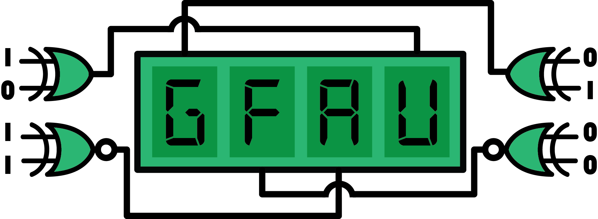

An arithmetic logic unit to perform finite field term generations and
operations. The unit serves as a computation engine for a relatively low-powered microcontroller.

<!-- ## Preview


	https://cloud.githubusercontent.com/assets/754514/14509716/61ac6c8e-01d6-11e6-879f-8308883de790.png
	https://cloud.githubusercontent.com/assets/754514/14509717/61ad05ae-01d6-11e6-85ae-5a817dd8763b.png
	https://cloud.githubusercontent.com/assets/754514/14509714/61a89708-01d6-11e6-8fcd-74b002a060df.png


 -->